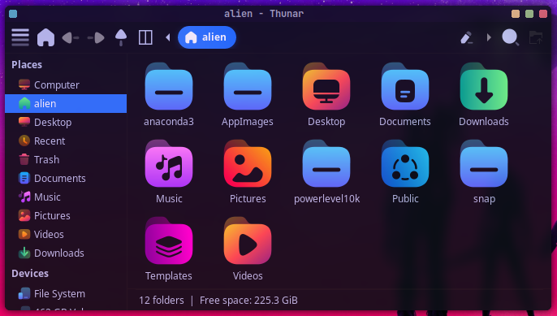

# Flat Remix GTK Blue Dark

1. [Flat Remix GTK Blue Dark](#flat-remix-gtk-blue-dark)\
    1.1. [Description](#description)\
    1.2. [Installation](#installation)

## Screenshots

### Description
Theme for Window Manager based on `XFCE`, you can also try it in `GTK`.

### Installation

* Clone the repository and copy the folder to the `.themes` directory.
* For transparency and blur you can use picom.

